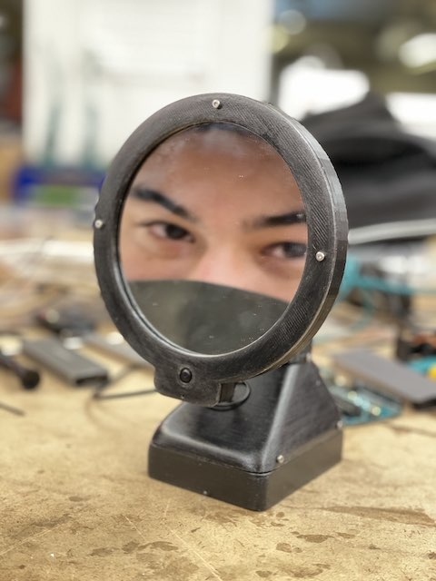
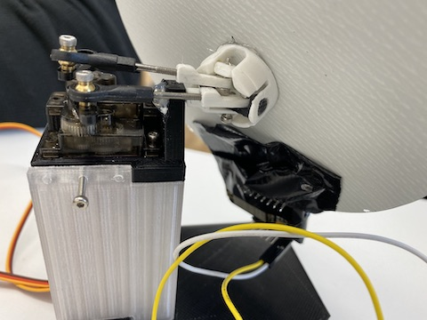
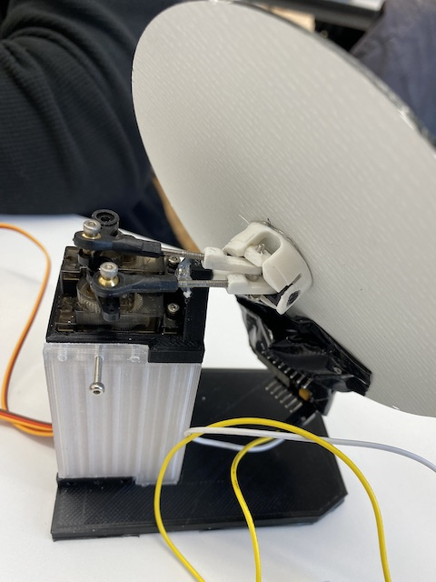
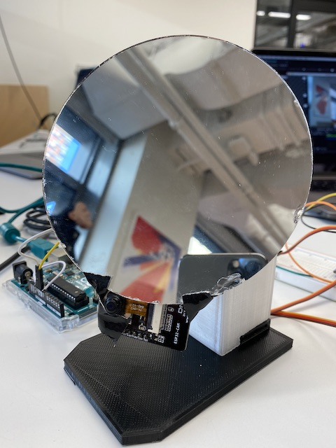
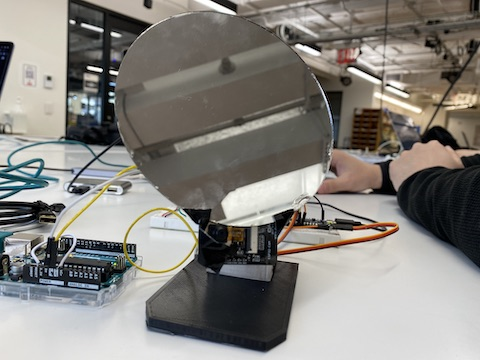

This midterm project was a collaboration between myself, Kevin He and Nick Boss.

# Project Overview
For our assignment we had turn an inanimate object in a robot, giving it properties of automation as well as qualities of human-like personality. We decided to go with the idea of a mirror that exhibits shyness, and that would over time form a relationship with the user. The shyness interaction would be portrayed by the mirror not looking at the user interacting with the mirror. If the user moves to try to look into the mirror the mirror would look away. The mirror would become less shy based on two factors; the longer the user stands in front of it, and if the user speaks the mirrors name. If the user speaks the name of the mirror the mirror will also briefly look at the user and if the _relationship score_ (a value recorded on the arduino that increases based on these two factors.) increases high enough the mirror will stop being shy and will instead track the face of the user.
# Technical Overview
The project consisted of two methods of input. These were voice (computer microphone), and camera (esp32cam & laptop camera). We initially used the esp32cam as the camera. We were able to host a webserver on the esp32 that streamed video to a url. We then access the url on a laptop and used the OBS virtual camera to use the streamed footage as a camera input into a p5/ml5 sketch. We chose the camera because of its small size, and we were able to attach it at the bottom of the mirror. We wanted to use a camera that would be attached to the mirror. Unfortunately the esp32 wasn't up to the task. The video feed was working with ml5 okay but the board would overheat and also disconnect frequently whenever it moved with the mirror. In the end we built another version that used a laptop's webcam.

Data was recorded within the p5/ml5 sketch. The sketch would run the camera feed through posenet to obtain the position of the user's face. We also used the p5-speech library to allow the robot to listen for its name being spoken. This data was passed through to an arduino that was controlling two servos that would allow the camera to tilt on two axis. As mentioned earlier a relationship score would be calculated that would cause the mirror to either shy away from the user or track the user.

[P5/ML5 Sketch](https://github.com/davidalexandercurrie/shy-mirro/blob/main/sketch.js)

`video: https://youtu.be/YaeoSl4Rl_M`

`video: https://youtu.be/FISSzuq9g8M`
