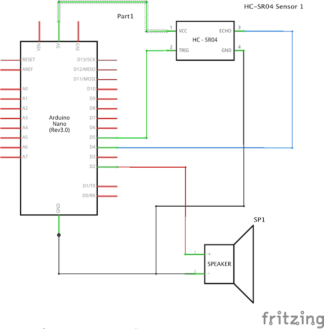

Proposal for assignment 1: a musical instrument combining accelerometer, gyroscope, and ultrasonic distance sensor.

Note: we are using the built in accelerometer and gyroscope.
Library: <https://github.com/arduino-libraries/Arduino_LSM6DS3>



```c
/ ---------------------------------------------------------------- //

#define echoPin 2 // attach pin D2 Arduino to pin Echo of HC-SR04
#define trigPin 3 //attach pin D3 Arduino to pin Trig of HC-SR04
#include "pitches.h"
#include "Arduino_LSM6DS3.h"

// defines variables
long duration; // variable for the duration of sound wave travel
int distance; // variable for the distance measurement
// notes in the melody:
int melody[] = {

  NOTE_C4, NOTE_G3, NOTE_G3, NOTE_A3, NOTE_G3, 0, NOTE_B3, NOTE_C4
};

long note1 = 0;
long note2 = 0;

// note durations: 4 = quarter note, 8 = eighth note, etc.:
int noteDurations[] = {

  4, 8, 8, 4, 4, 4, 4, 4
};

// values for acceleration and rotation:
float xAcc, yAcc, zAcc;
float xGyro, yGyro, zGyro;

void setup() {
  pinMode(trigPin, OUTPUT); // Sets the trigPin as an OUTPUT
  pinMode(echoPin, INPUT); // Sets the echoPin as an INPUT
  Serial.begin(9600); // // Serial Communication is starting with 9600 of baudrate speed
  Serial.println("Ultrasonic Sensor HC-SR04 Test"); // print some text in Serial Monitor
  Serial.println("with Arduino UNO R3");

  // initialize accelerometer
  if (!IMU.begin()) {
    Serial.println("Failed to initialize IMU");
    // stop here if you can't access the IMU:
    while (true);
  }
}
void loop() {


  // Clears the trigPin condition
  digitalWrite(trigPin, LOW);
  delayMicroseconds(2);
  // Sets the trigPin HIGH (ACTIVE) for 10 microseconds
  digitalWrite(trigPin, HIGH);
  delayMicroseconds(10);
  digitalWrite(trigPin, LOW);
  // Reads the echoPin, returns the sound wave travel time in microseconds
  duration = pulseIn(echoPin, HIGH);
  // Calculating the distance
  distance = duration * 0.034 / 2; // Speed of sound wave divided by 2 (go and back)
  // Displays the distance on the Serial Monitor
//  Serial.print("Distance: ");
//  Serial.print(distance);
//  Serial.println(" cm");

  note1 = (xAcc+1)*melody[0];
  tone(4, abs(note1));
  delay(distance/2);
   note2 = (yAcc+1)*melody[1];
  tone(4, abs(note2));
  delay(distance/2);


// if both accelerometer and gyrometer are ready to be read:
  if (IMU.accelerationAvailable() &&
      IMU.gyroscopeAvailable()) {
    // read accelerometer and gyrometer:
    IMU.readAcceleration(xAcc, yAcc, zAcc);

    // print the results:
    IMU.readGyroscope(xGyro, yGyro, zGyro);
    Serial.print("X: ");
    Serial.print(xAcc);
    Serial.print(",");
    Serial.print(" Y: ");
    Serial.print(yAcc);
    Serial.print(",");
    Serial.print(" Z: ");
    Serial.println(zAcc);
//    Serial.print(",");
//    Serial.print(" X-gyro: ");
//    Serial.print(xGyro);
//    Serial.print(",");
//    Serial.print(" Y-gyro: ");
//    Serial.print(yGyro);
//    Serial.print(",");
//    Serial.print(" Z-gyro: ");
//    Serial.println(zGyro);
  }

}
```

`youtube: gjYilf5iATc`

`youtube: LrzWrm2YviI`

``

Ideas to expand this experiment: 

1. Sound synthesis with Mozzi library <https://sensorium.github.io/Mozzi/>
2. Use Max or another tool to handle audio <https://cycling74.com/products/max/>
3. Use Wekinator to control mappings <http://www.wekinator.org/>
4. Add an Amplifier to the circuit for more volume <https://components101.com/modules/pam8403-stereo-audio-amplifier-module>