# Poster Revision

Part 1 of this week's assignment was to make revisions to our poster from last week based on class feedback. I made the changes the had been recommended to me by many people. I centered the _winter show 2020_ text vertically inside the white box, and I changed the date and venue text to stay within the bounds of their box. I also stopped the boxes from moving around as I found this to be a little annoying. In the interest of strengthing the layered feel of the poster, I added a little transparency to the boxes and the _ITP IMA_ text.

<iframe style="border: none" src="https://davidalexandercurrie.github.io/itp-poster/" width="425" height="350"></iframe>

# Logo

## Inspiration

My initials are d.a.c. which in audio programming stands for digital to analog converter. I thought it would be fun to try to use this for my logo. Here are some ways _dac_ comes up in some of the technology I use regularly.

Max
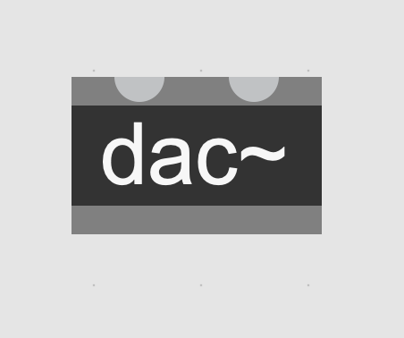

ChucK
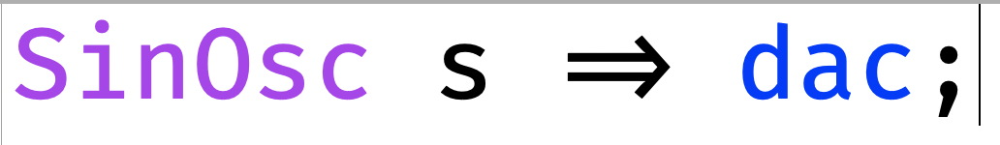

Microcontrollers
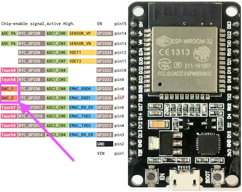

I tried to be proactive while creating this logo by regularly exporting images whenever I reacted a new checkpoint. My unfamiliarity with illustrator came through however. After some hours of work I checked the images and realized I had been exporting them at very low resolution and they looked terrible. I tried my best to re-create them in illustrator using the trace tool but sadly it wasn't great. I included them anyway so that I can show at least a sense of the pathway I took through this assignment.

In this first example I was trying to find a way to use the tilda character from the max example I showed earlier. I think it could have worked but I decided it's too closely related to max in general. Also these colours are not great.

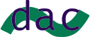
I thought instead I should try to include my name that would function as an underline (and a sort of explanation of _dac_).

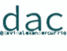
Here I try some other colours.

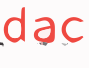

I liked this design but didn't feel like it really suited me personally.
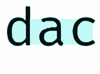

This one was awful.

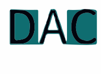

I accidentally discovered how to push letters around in illustrator so gave that a shot.

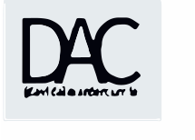

Decided for the second time around to try the _name as an underline_ thing. Added the _@_ because this is the tag I generally use in social media, instagram, github etc.

Added some colours. Didn't really like the blue.

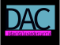

## Final Logo & Style Guide

I liked the pink so I used the colour tools in illustrator to choose an algorithmically linked colour and ended on Bright Turquoise

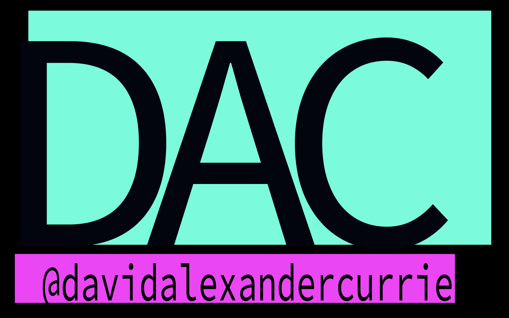

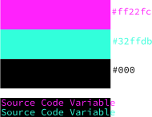

<iframe src="https://giphy.com/embed/ePNBmenHCyFTFFjloa" width="480" height="300" frameBorder="0" class="giphy-embed" allowFullScreen></iframe>
