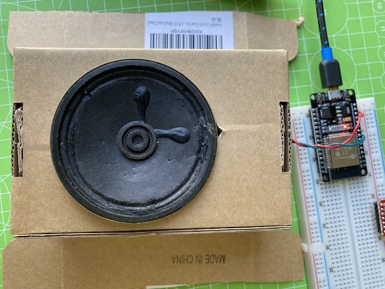

# Proposal

I plan to create a **spatial audio synthesis installation** using **hot-word detection** and **tele-robotic techniques**. The piece consists of multiple devices controlled by ESP32 micro-controllers. The devices will form a mesh network and relay information about their surroundings to the other devices.

The devices will be positioned in a grid roughly 5x5m. When users walk through the space and say the _hot word_, devices in range will detect it and respond with different audio synthesis processes. Any information about the devices that responded will then be communicated to the other devices, and the sounds of all devices will change accordingly to create new spatial audio responses.

# Technical Overview

Each device requires an **I2S microphone**, **PAM8403 audio amplifier**, and **4-ohm speaker**. The hot-word detection will be trained via **TensorFlow** and converted a to **TFLite** model that will run on that **ESP32**. I will use basic digital signal processing techniques to manipulate the voltage of the speaker.

# Audio Experiments

`video: https://www.youtube.com/watch?v=YpmhY-AWTXw`
