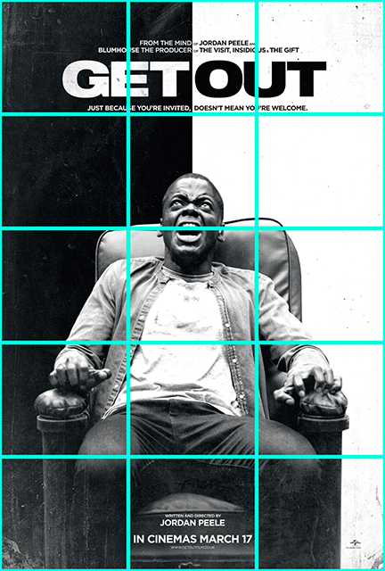
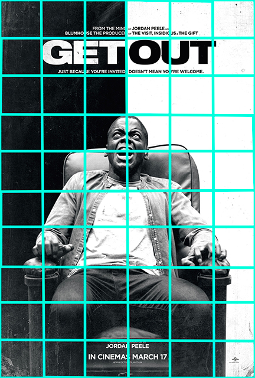

## Layout

The poster layout fits in its simplest form to a 3x5 overlay. Seeing the different elements of the poster conforming to the grid reminds me of the structure of a bar of music. The title sits along the bottom of the first row announcing loudly the first beat of the bar and the name of the film.

With added subdivisions - increasing the grid resolution to 6x10 - we are able to make more sense of the underlying patterns. The face of the figure is in horizontally centered and vertically slightly above center.  This 2x2 area draws our immediate attention along with the 4 grid spaces enveloping the title. The top half of the image is divided into two sides also accentuated by the contrast of the black and white text and background. The bottom half of the image divides the space into 3 columns producing a poly-rhythmical juxtaposition over the vertically bisected background.

## Font Faces, Color & Negative Space

The fonts are similar, block-like styles with the main title font being thicker and more impactful. Placement of the text around the title also serves as a reinforcement and from a distance would be seen more as an underline text-decoration rather than text in its own right.

The background and text act as negative space to further enhance our view point of the extremely distraught man held in place by fear. The text is enveloped by inverted black & white serving functionally to allow the words 'get out' to be written without a space in-between and maintain legibility. The stark contrast between black and white also makes reference to the strong themes of systemic racism that are portrayed throughout the film.