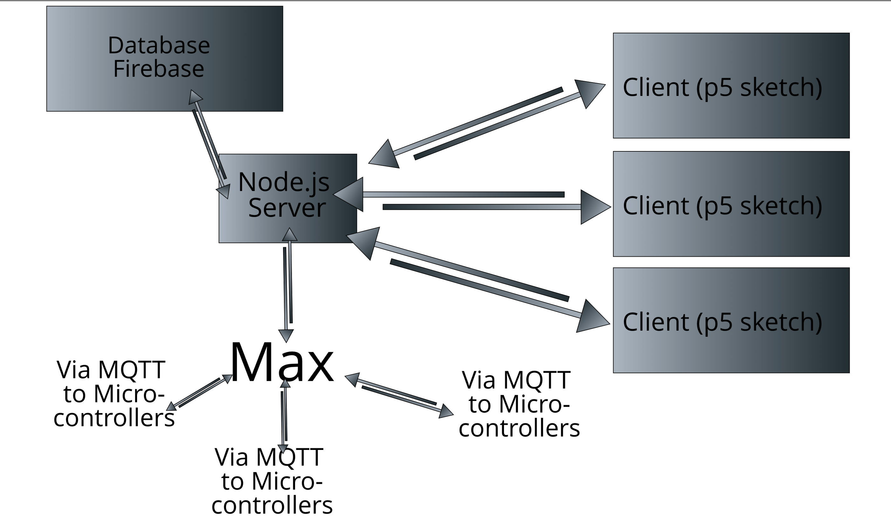
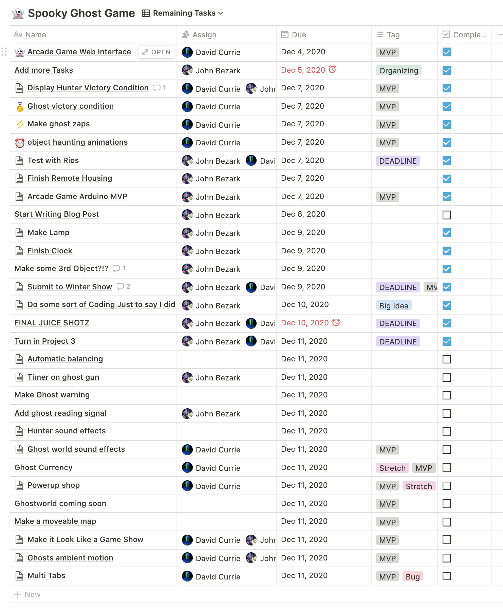
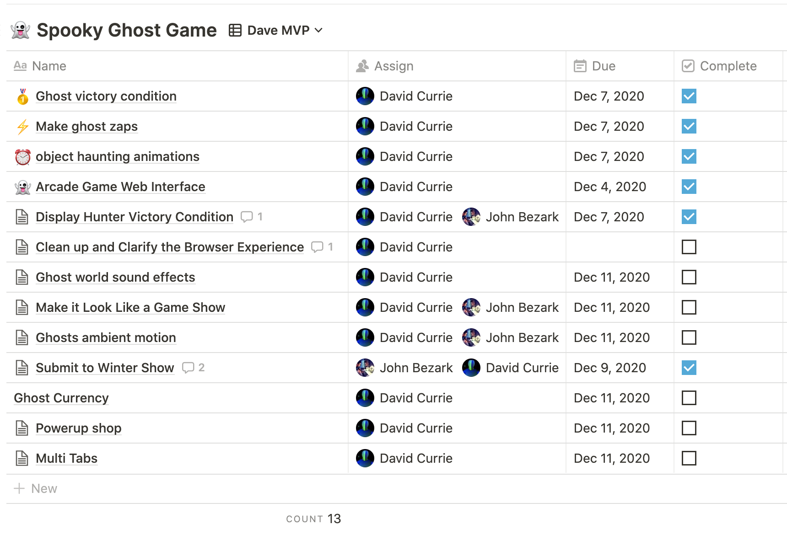
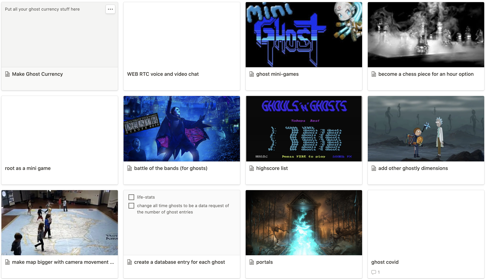
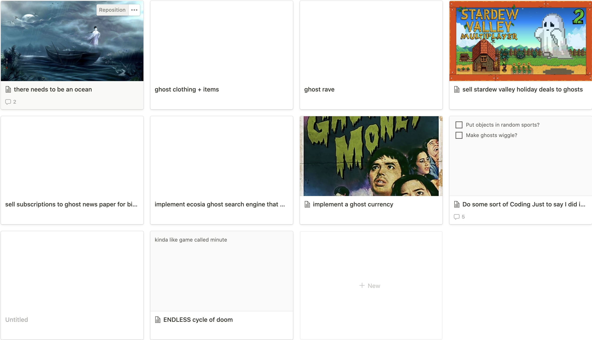

GitHub Repo: <https://github.com/davidalexandercurrie/hopes-and-dreams-of-the-ghosts>

Game: <https://spooky-ghost-game.herokuapp.com/>

For our project we created a 1 vs many game where a _ghost hunter_ in a real physical space plays against a team of _ghosts_ the play from a web browser.

The goal of the ghosts is to be able to haunt two objects simultaneously before the 3 minute timer comes to an end.

When ghosts in the browser go inside the household objects in the game, this causes the real objects that exist in the physical world to be affected and causes shaking & lights that change colour and other spooky effects.

Below is a chart that shows the many networking aspects of the project and how to come together. (Later we also added web-rtc so that the ghosts can see John's room as the background of the browser-game)

Below are some shots from our notion that show our workflow & ideation process.

Below here are future weirder ideas that I hope to get to some day!

