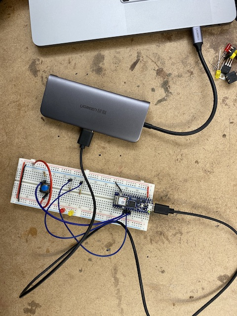
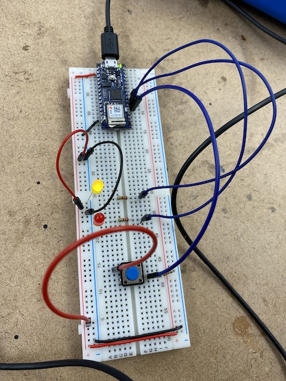
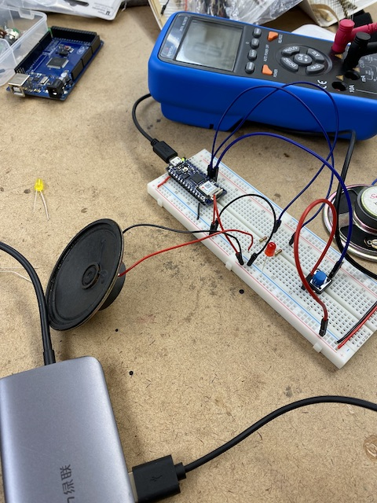

I enjoyed this weeks labs. I spent a lot of time going through all the reading materials and particularly enjoyed reading about how different variable types are stored in memory. There was a lot of time spent troubleshooting. I forgot for the second week in a row that the power rails on my breadboard are not connected all the way along. There is a small gap in the middle between the top and bottom halves. Viola was able to diagnose the problem by running a few continuity tests on my circuit with the multimeter.

Finally solved it and was reminded of the important of trouble shooting the most basic possibilities first. 

Here I wired up the circuit with the speaker. It wasn't working at first and only started working once I unplugged the LED. Maybe the speaker required more current?

Was able to get the speaker going and put 5 years of sonic arts education to work in the following two sound works for 8 Ohm speaker.

`youtube: https://www.youtube.com/watch?v=sWbjmmYuFiU`

`youtube: https://www.youtube.com/watch?v=Biv35e6tUcg`

Here is an LED being controlled by a potentiometer for good measure.

`youtube: https://www.youtube.com/watch?v=NXI9waSMxvs`