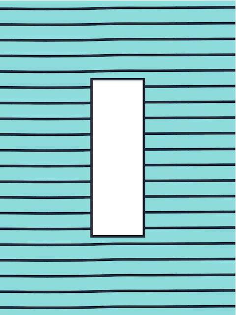
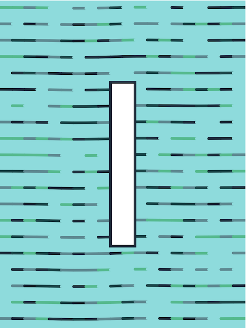
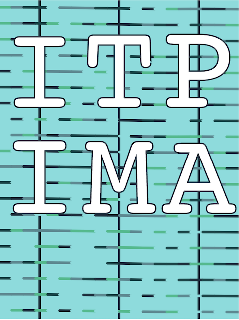
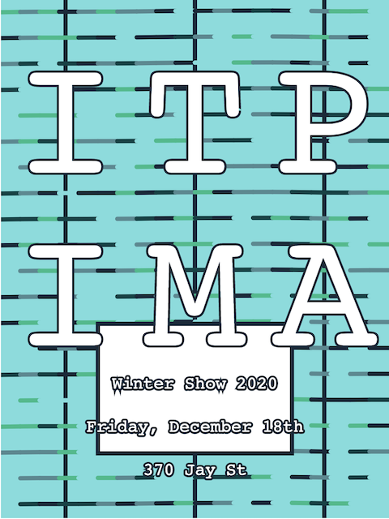
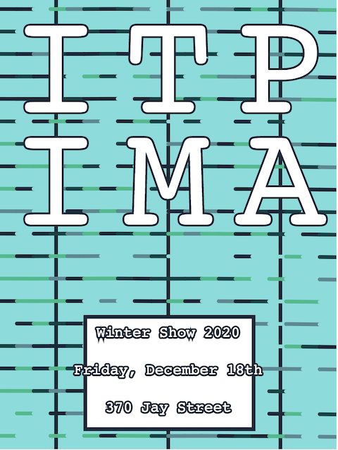
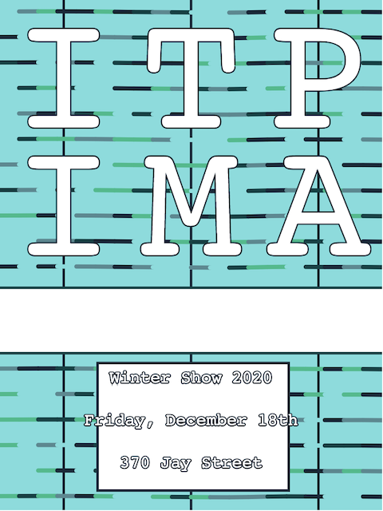

Design Process & Decision Making

I'm not sure if I was allowed to use P5 this week or not but I was desperate to code something so I did.
I started out by creating a wintery pallette of greens & blues using [this online palette tool](https://coolors.co/).

I created a background of wavy lines that moves and animates slightly in the sketch version. This was done using the [perlin noise](https://p5js.org/reference/#/p5/noise) function in p5 which creates a stream of numbers that fluctuate randomly and applying this to points along the lines.

I decided to disperse the colors from the palette randomly throughout the background lines. The white box in the center was originally going to be the _I_ from _ITP_ and the letter was going to iterate through the words _ITP_ and _IMA_ but later I decided to just write them out in their entirety.

Here is the text in its first iteration.

Later I moved it up to the top. I found that including the vertical grid lines actually helped make the poster's structure feel more cohesive. Without them the letters didn't seem to feel like they were positioned correctly. I think this is because the legs of the _A_ extend out much further than the base of the _I_. The vertical lines are not animated and swaying like the horizontal lines and so I think they help to hold things together.

I made this version after looking at the [Yale School of Art Website](https://www.art.yale.edu/). I liked the way many elements of the page are sort of at odds with each other in terms of grid. I moved the titles up in the next design.

I actually really liked this design but at the time felt as though there was too much space in the middle of the poster below the titles.

Here is the final animated version. I've had a lot of comments to keep the text inside the box at the bottom so maybe that would have been better. The idea of having the text outside of the box was to give a feeling of layering with the moving box, waving lines and the text that is locked in place.

The code can be found [here](https://github.com/davidalexandercurrie/itp-poster/blob/main/sketch.js)

<iframe style="border: none" src="https://davidalexandercurrie.github.io/itp-poster/" width="425" height="600"></iframe>
