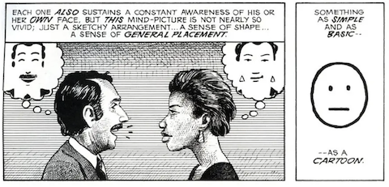

This week we were asked to read Understanding Comics - The Invisible Art by Scott McCloud. The book is itself a comic that examines the world of comics.

The book addresses many areas of comics most of which I had not considered before. I found myself learning concepts not just about comics but also the film & visual art worlds and more generally I engaged in thought about storytelling practices.

The book goes into a lot of detail in many areas:

### Definition:

- pokes fun at the difficulty of defining what a comic is

### History

- Egyptian drawings
- Comics have been around for a long time
- Western vs Eastern

### Symbols

- Realism and detail can be abstracted away to allow elements of the drawings to have more meaning

### Realism vs cartoony

- Style of japanese comics often uses extremely realistic backgrounds combined with less realistic characters

### Closure

- Imagination in between the frames

### Time & Motion

- Allowing the audience to use their imagination
- Time can be portrayed by adjusting the size of the bounding boxes
- Time in comics can be abstract and doesn't need to follow reality

### Emotions

- Shapes & lines can imply emotions
- Abstract backgrounds can enhance the emotion of a scene by drawing our attention to the emotions of a character rather than the _true reality_ of the scene
- Lettering/Fonts are often used to portray emotions in a scene

Some moments in the book that I found particularly interesting:

Final Thoughts:
I found the book to be a very enjoyable read. The most important realisation for me was the discussion around _closure_. I have a lot of thoughts now around how to better use these techniques to enhance my own story for my after effects assignment particular the transition between shots and scenes, timing and motion. I am very interested in playing with the viewers imagination and realise the importance of what I show and do not show to the viewer.
