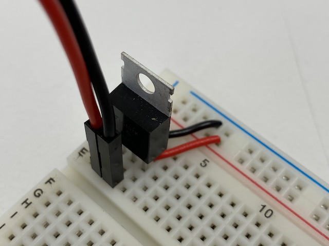
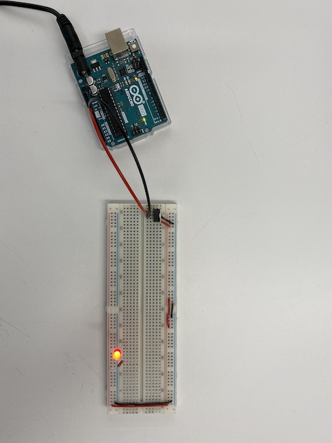
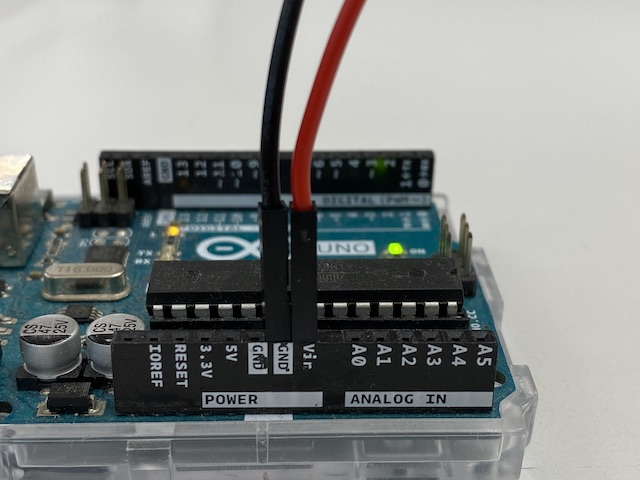
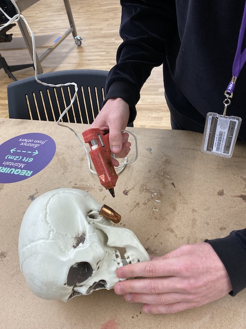
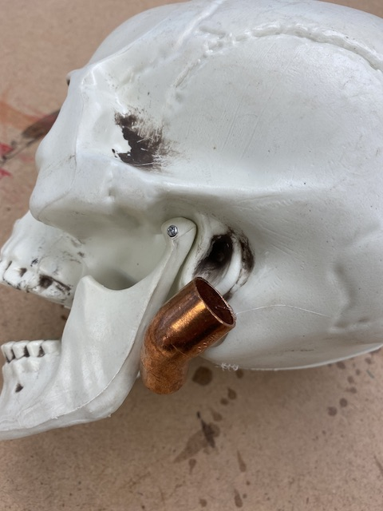

I did not have a DC Jack component when I worked on this lab and so I powered my circuit from my Arduino Uno instead. This could have been achieved by either taking power from the 5V output or the Vin output (which outputs at the same voltage as the DC power outlet that is plugged into the Arduino Uno - in my case 12V). I used the Vin Output so that I could include the voltage regulator into my circuit (voltage regulator wouldn't be required if I had just used the 5V output.

Here is the completed circuit powered from the Arduino.

And here you can see the pins connected to the Arduino Uno.

For the custom switch I used a skull Viola He and I found on the floor. A simple way to create the switch was to glue materials to the jaw and bottom of the ear of the skull. I used a piece of metal on the ear and some tin foil wrapped around the jaw. I tried to solder the wires on to the conductors and it was a bit fiddly so in the end I just taped the wires on.

Final result: a skull that turns on an LED when the jaw opens.

`video: https://youtu.be/U8n5ybLFNSA`