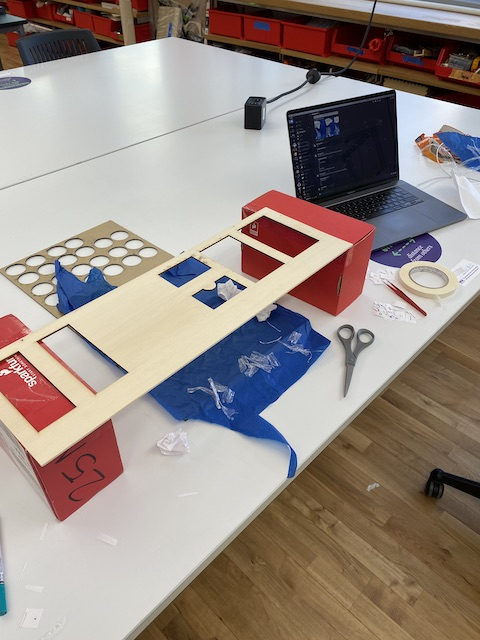
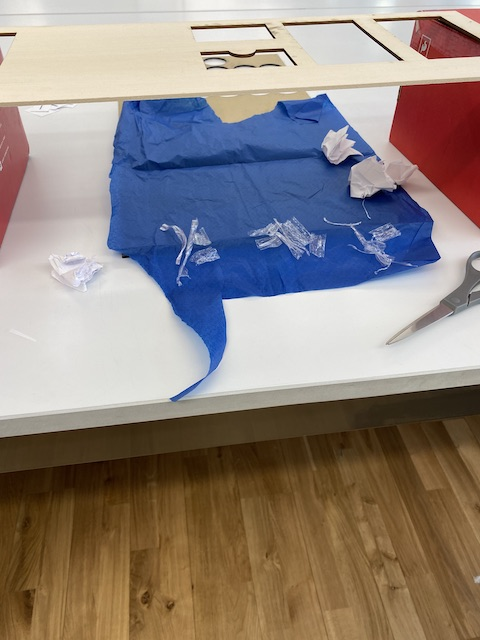
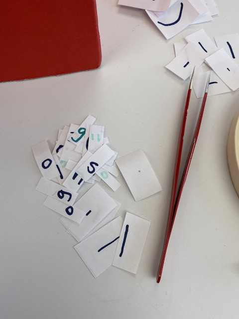

This week we were asked to create two .gif files with stop motion animation.

I setup my work environment by making a stand to place the camera on to look straight down on what I planned to photograph. I taped a piece of paper underneath onto the table so that I had a reference for the frame. 

I downloaded the stop motion remote camera app so that I could use my phone camera as the source for Stop Motion Studio. This was helpful because capture images but rather on my phone by hitting the return key on my computer rather than needed to touch the phone.

For the first gif I went with the idea associated with learning programming languages of printing *hello world*. 
There were a number of challenges I came across during the animation process. I wanted to make the cursor blink like it would in a text editor. This was not terribly successful but the idea was to imitate the way it blinks in the text editor where it is solid while typing and then blinking while not typing. I think it would have helped to make the cursor a different color to differentiate it from the rest of the text. Also I think the pacing could have been much slower. I was became more aware of time and realized the importance of thinking in terms of frames per second. The time it takes to set up the camera shots can have a distracting effect as it can feel like a lot of time has past but in reality a frame is a fraction of a second.

For the second animation, I drew inspiration from the resources I had around me. As with the first animation I think the pacing is a too quick. I am drawn to the aspects of animation relating to timing and calculation and this assignment has given me a lot to think about. Making stop motion animation with the cut out paper elements was very fiddly and I learned the importance of having a good system and workflow in place. 

I am looking forward to future assignments and learning more about animation. As a sound artist and musician I also look forward to combining sound with these creations.