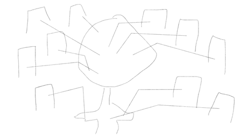
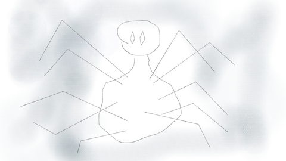
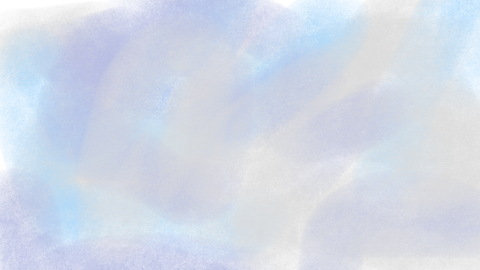

I am working with Duncan Figurski on animation assignment 2. This week we met to plan out our story elements and work process.

We came up with a plan to create a story based on a character that lives multiple lives throughout the film. We decided each _live_ would be allowed to be vastly different in both narative and visual style.

Above is the character Duncan created in Illustrator that we will be basing much of the story around. Duncan designed the character in a way that allowed a side angle version of each character to merge together to create a new version of the character which is what originally gave us the idea to base the story on a number of different lives the character has. We loosely decided the character would merge together in some way at the end of each scene and begin a new life in the next scene.

The work was devided up in a way that we both designed a scene that we will then fuse together. My scene depicts the character being created on a factory assembly line. The character is built by machines on a seemingly endless conveyor belt and eventually comes face to face with one of the machines that the character then becomes joined with. All the machines in the factory then converge on the new merged character dismantling it and themselves and the scene dissipates into a cloud of smoke.

Below are the frames I created for the storyboard.

Below are both Duncan's scenes, and mine, in Gif format.

