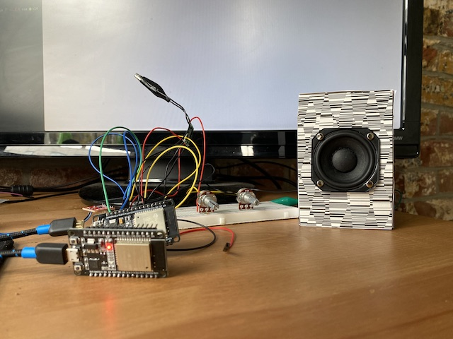
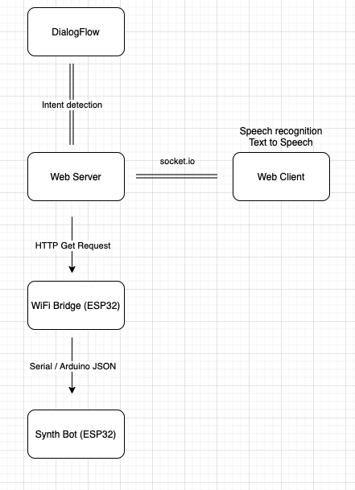
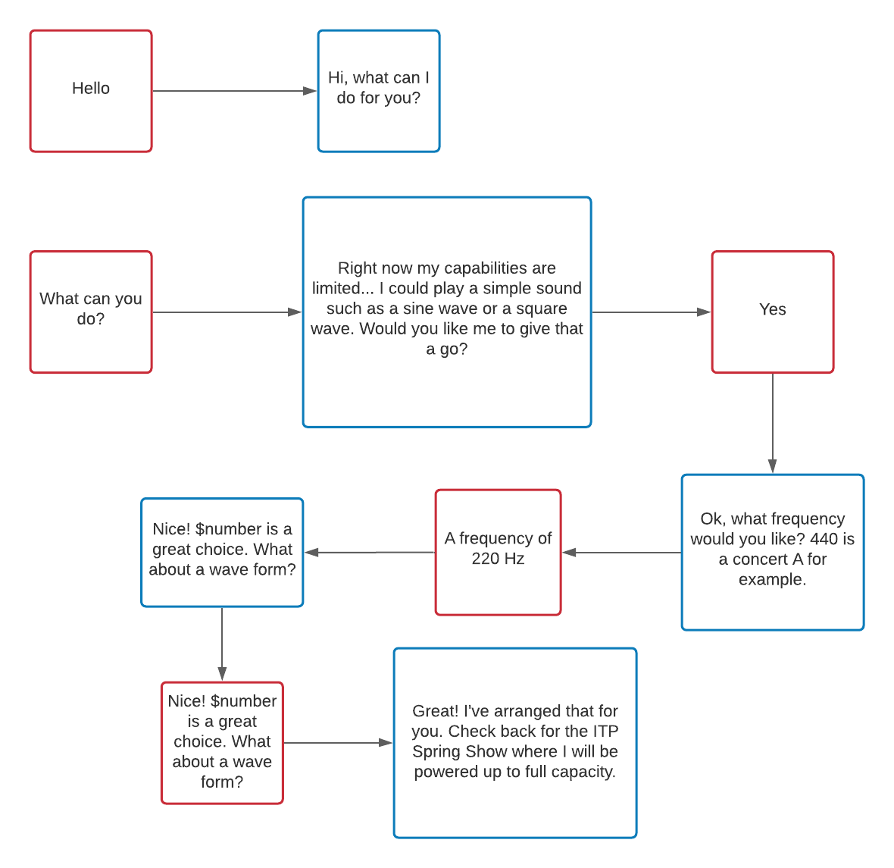

# Project Description

An audio installation incorporating machine learning, physical computing and audio digital signal processing. The project consists of a few tiny audio synthesis bots and a voice assistant AI. Users can have conversations with the voice assistant that in turn instructs the main synth-bot to create sounds. The bots are networked and generate audio that compliments each other, acting as a robotic choir of sorts.

# Demos

`video: https://www.youtube.com/watch?v=Gs1Lw5yfhUU`
`video: https://youtu.be/6o0p4uoA4uw`




# How it works

### Voice Assistant and User Interface

Users interact with the voice assistant through a website that uses the [p5-speech](https://idmnyu.github.io/p5.js-speech/) Library to create both the synthesized voice and speech recognition of the audio stream. The website instructs users to 'Ask me what I can do'. When a user starts speaking a voice assistant answers and a conversation can then take place. The voice assistant was created with [Google DialogFlow](https://cloud.google.com/dialogflow/), which can be used to make chat-bots. DialogFlow focuses on gauging the user's intent rather than specific phrases; it utilizes natural language processing to register similar phrases that mean the same thing but may differ in exact wording from the phrases each intention is trained on.



Below is a diagram of a sample conversation:



The website is being served by a simple [express](https://www.npmjs.com/package/express) webserver that is hosted for free on [heroku](https://www.heroku.com/). After the user's speech is converted to text, that text is then sent via web sockets to the webserver and then from the webserver to DialogFlow; computation takes place in the cloud to determine how the chat-bot should respond, and that response is then sent back to the webserver and back to the website where the response is converted from text to speech.

The conversation relates to getting the audio-bots to play sounds and ends when two requirements are met:

1. The user has asked for one of the following waveforms... Sine, Square, Sawtooth, Triangle
2. The user has specified a frequency (pitch) for the waveform.

Once these conditions are satisfied, a javascript object is created on the webserver that holds the frequency and waveform values.

### Audio Bots

My installation for the ITP Show featured 1 main audio bot that responds directly to user interaction and 3 secondary audio bots that react sonically to the main audio bot, either by harmonizing or by adding textural accompaniment.

I used ESP32 micro controllers to power the audio bots. I chose the ESP32 for its WiFi capabilities but also because it contains Digital to Analog Converter (DAC) output pins. When connected to a speaker, sine, square, sawtooth, and triangle waveforms can be generated.

One ESP32 device was setup to periodically (every 2 seconds) send a GET request to the server to check if any instructions had been initialized on the server. If that was the case this data would be handled via the [Arduino JSON Library](https://arduinojson.org/) and sent via serial to the main synth bot that would play the tone the user asked for. Subsequently, this would trigger the secondary bots to play sounds that were derived from the pitch / wave shape arguments. The bots had a set of 8 different presets (that still exhibit a lot of room for randomness)! From time to time, they will switch which preset they are using as well as update their pitch if any new instructions are registered.

Below are the audio functions I created (a sort of mini synthesis library for ESP32). Note that micro controllers do not run at typical audio sample rates, so the computation used to generate the audio signals relates to the [Arduino micros() function](https://www.arduino.cc/reference/en/language/functions/time/micros/) rather than sample increments (a typical method for computing audio wave shapes in programming).

Audio Functions

```c
float sine(float freq, float volume)
{
  float SI = freq * 2 * PI / SR;
  p = fmod(micros() * SI, 2 * PI);
  out = (sin(p) * volume + 1) / 2;
  return out;
}

float saw(float freq, float volume)
{
  float SI = freq * 2 * PI / SR;
  p = fmod(micros() * SI, 2 * PI);
  out = ((p / PI - 1) * volume + 1) / 2;
  return out;
}

float tri(float freq, float volume)
{
  float SI = freq * 2 * PI / SR;
  p = fmod(micros() * SI, 2 * PI);
  float sig = (p / PI < 1 ? p / PI * 2 : 2 - (p / PI - 1) * 2) - 1;
  out = (sig * volume + 1) / 2;
  return out;
}

float square(float freq, float volume)
{
  float SI = freq * 2 * PI / SR;
  p = fmod(micros() * SI, 2 * PI);
  float sig = (p / PI > 1 ? 2 : 0) - 1;
  out = (sig * volume + 1) / 2;
  return out;
}
```

All of these audio functions take frequency and volume as inputs and output a signal. This allows for modularity, for example, a sine wave could take another audio signal e.g. a sawtooth wave as the input for its frequency [(frequency modulation)](https://en.wikipedia.org/wiki/Frequency_modulation), or its volume [(amplitude modulation)](https://en.wikipedia.org/wiki/Amplitude_modulation).

That might look something like this:

```c
float output = square(sine(10, 1), tri(1, 1));

int out = output * level;

dac_output_voltage(DAC_CHANNEL_1, out);
```

But could go further to create even more complex sounds:

```c
float output = square(sine(square(4, 1), sine(1, 1)), tri(1, saw(10, sine(4, 1))));

int out = output * level;

dac_output_voltage(DAC_CHANNEL_1, out);
```

Unfortunately, the sounds tend to lose their clarity when the function gets too complex. This is probably due to the nature of working with micros() rather than exact audio samples. I still found the sounds interesting.

Each audio bot uses a [audio amplifier](https://components101.com/modules/pam8403-stereo-audio-amplifier-module) and 3W speaker, which can be powered by battery. Since the audio bots connect to each other via a WiFi mesh network, they could be arranged or disbursed throughout a space as standalone wireless objects. I look forward to working on an in-person installation that plays with the spatial possibilities and qualities of the audio bots.

[Synth-bot Code](https://github.com/davidalexandercurrie/synth-bot)
[Synth-Assistant Code](https://github.com/davidalexandercurrie/synth-assistant)
