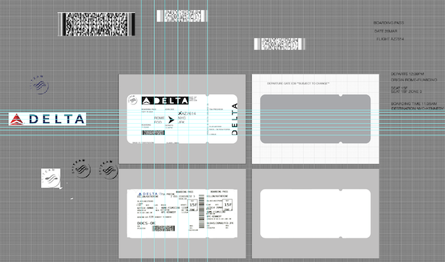
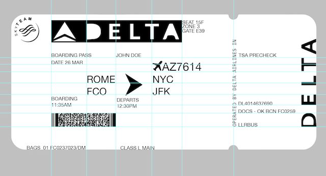
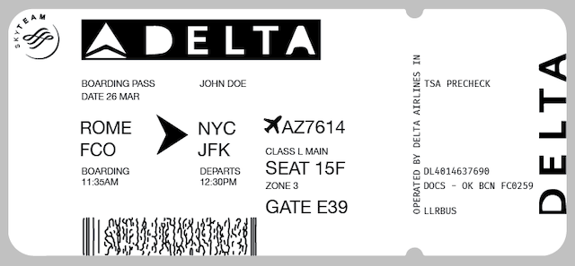
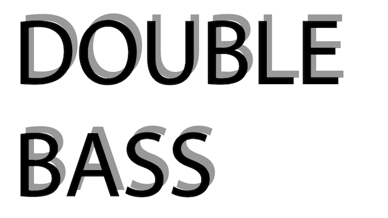
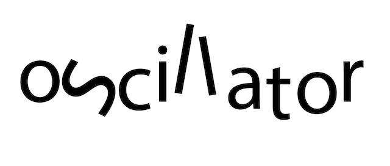
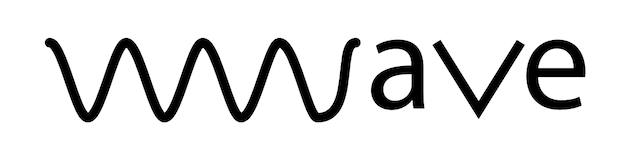

This week we were tasked with redesigning a boarding pass as well as creating three expression words. This was the first time in my life using illustrator and although the Friday workshops helped... it was slow going. I received excellent advice from my peers, Viola, Ahn, & Phillip, who instructed me to 'get everything on the page' and then work with what you have.

I like hot-keys, and I felt the software become more intuitive as I spent a bit of time remembering the combinations for repetitive tasks & tool selections. I found it interesting, following on from the previous week's assignment, to play with grid layouts and found that after a while it felt similar to editing other forms of media such as sound & media - there was a lot of _lining things up_.

This boarding pass will never be printed but it was still a very valuable exercise for me. The act of moving text elements around a canvas and engaging with their hierarchies has fundamentally changed the way I will approach design in my future projects. Here is the final boarding pass.

For the second part of this week's assignment I created **_THREE EXPRESSIVE WORDS_**. I was nice to see how simple ideas, often using only text, could add to the communication of an idea. I think _Double Bass_ was the most successful. Idea 2 fell a bit short and idea 3 may make sense in some contexts.

Special thanks to Viola, Ahn, & Phillip for all their help with getting me up and running with Illustrator as well as giving insight from their design backgrounds. Their comments and suggestions gave me a lot to think about and helped me engage more in this area that is very much out of my comfort zone.
